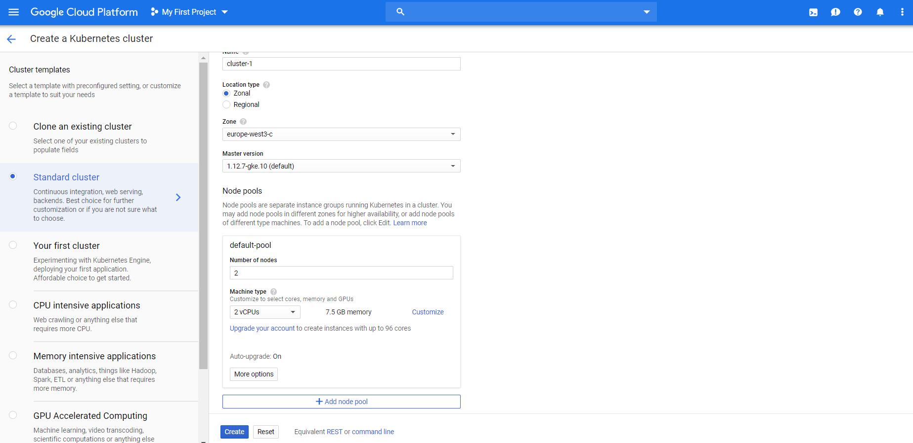
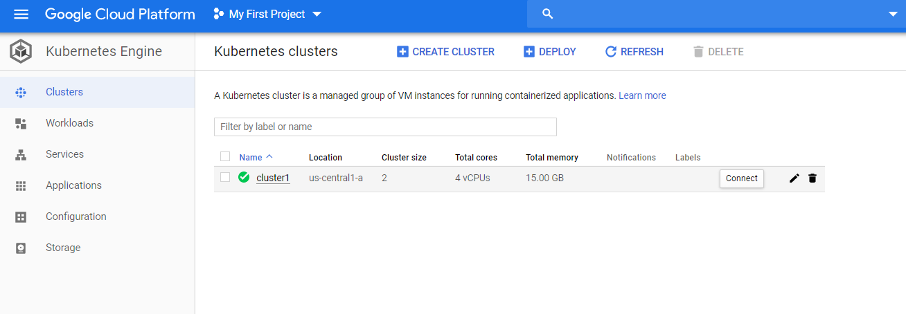
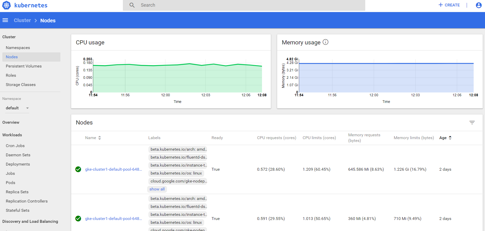
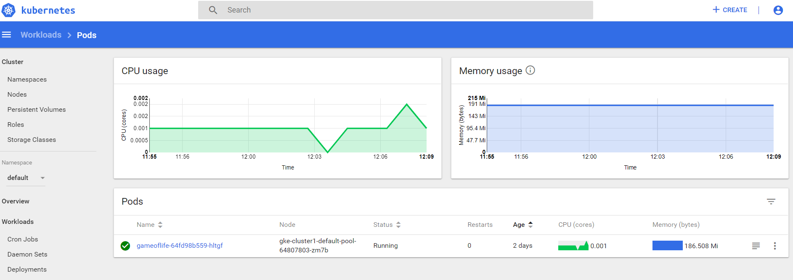
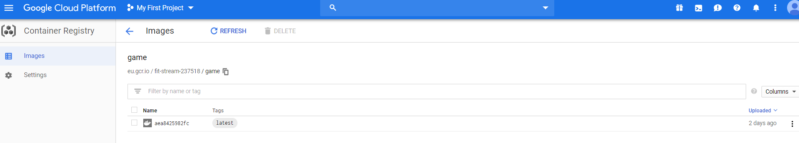
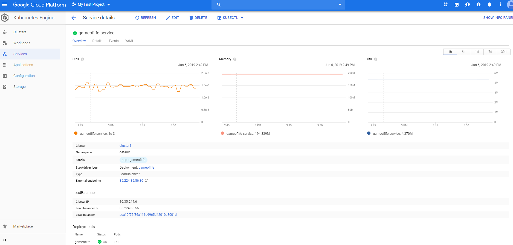

# Google Cloud Platform - Kubernetes

This is simple project which will describle how to use Kubernetes in Google Cloud Platform.

# Before begin

  - register your google cloud account;
  - enable Kubernetes Engine API, Container Registry API;
  - enable for your vm instance access to Cloud APIs;
  - install Cloud SDK -[Instruction](https://cloud.google.com/sdk/docs/#rpm).

# Creating Kubernetes cluster

 In Kubernetes engine service create cluster.
 
 
 
 
# Kubernetes dashboard

  - connect to your cluster via Google SDK;
  
 
 
  - creating clusterrole:
 
  ```bash
  kubectl create clusterrolebinding kubernetes-dashboard -n kube-system --clusterrole=cluster-admin --serviceaccount=kube-  system:kubernetes-dashboard
  ```
  - apply recommended kubernetes dashboard:
  
  ```bash
  kubectl apply -f https://raw.githubusercontent.com/kubernetes/dashboard/v1.10.1/src/deploy/recommended/kubernetes-dashboard.yaml
  ```
  - get token:
  ```bash
  kubectl -n kube-system describe secrets kubernetes-dashboard-token
  ```
  
  - start kubernetes dashboard:
  
  ```bash
  kubectl proxy
  ```
  
  - open dashboard:
  
  ```bash
  http://localhost:8001/api/v1/namespaces/kube-system/services/https:kubernetes-dashboard:/proxy/
```

 # Kubernetes cluster
 
  ```bash
  [root@gcloud ~]# gcloud container clusters get-credentials cluster1 --zone us-central1-a ***************
                   Fetching cluster endpoint and auth data.
                   kubeconfig entry generated for cluster1.
 ```
 
 ```bash
 [root@gcloud ~]# kubectl get nodes
NAME                                      STATUS   ROLES    AGE     VERSION
gke-cluster1-default-pool-64807803-kwbt   Ready    <none>   2d19h   v1.12.7-gke.10
gke-cluster1-default-pool-64807803-zm7b   Ready    <none>   2d19h   v1.12.7-gke.10
```

```bash
[root@gcloud ~]# kubectl get pods
NAME                          READY   STATUS    RESTARTS   AGE
gameoflife-64fd98b559-hltgf   1/1     Running   0          2d
```







# Deploying

For deploying we will using Google’s Container Repository. Enable container registry and check permission for pushing images.

  - on your working vm host build your application container image;
  
  [Build-GameOfLife](https://github.com/docclion/Build-Game-Of-Life)
  
  - tag your local image and push to container registry.
  
  - configure Docker's configuration file:

  ```bash
  gcloud auth configure-docker
  ```
  
  [Usefull_link](https://cloud.google.com/container-registry/docs/pushing-and-pulling?hl=en_US&_ga=2.64090159.-1619095932.1555178622)
  
  ```bash
  docker tag game eu.gcr.io/fit-stream-237518/game
  ```
  
  ```bash
  docker push eu.gcr.io/fit-stream-237518/game
  ```
  
  
  
  
  - run service:
  
  
  
  
  

  
  
